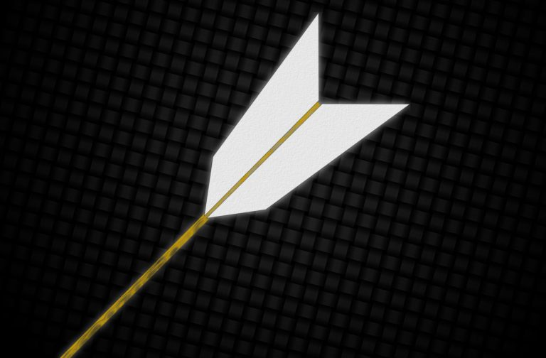
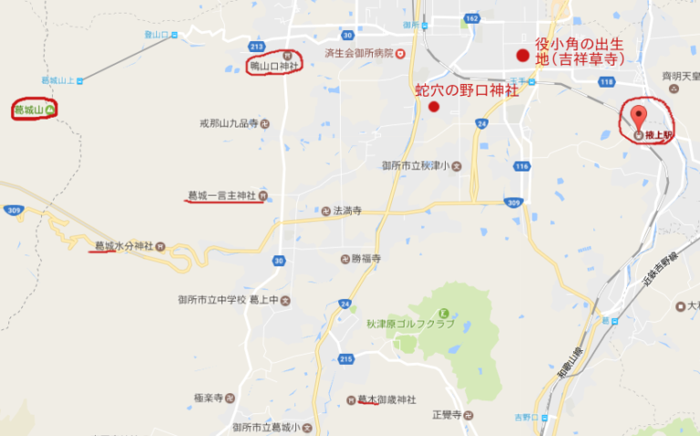

以前、奈良御所市蛇穴の野口神社の祭りと、京都烏丸の井戸のあいだに、秦神話つながりがあるという話を書いた（→<a href="https://hatarakuki.tokyo/posts/something-sealed-in-a-well/">京の井戸に封印されしもの−秦氏の痕跡を神話論的に探る</a>）。この件についてさらに新しい発見があったので書いてみたい。

## 賀茂か秦か
> #### 謡曲「賀茂」
>
> 清き水上尋ねてや、清き水上尋ねてや、賀茂の宮地にまいらん。

能「賀茂」では、京都の賀茂社の創設神話がかたられる。  
女が川で流れてきた矢を拾い懐妊。生まれた子が三歳になった時、父は白羽の矢であると女は告げ、矢は昇天して雷神ワケイカヅチの姿をあらわす。女は「秦の氏女」と呼ばれている。  
これとほぼ同じ話は松尾大社にも伝わる。秦氏ゆかりの神社だ。では、この神話はいったい賀茂のものなのか、秦のものなのか。  

賀茂と松尾の神社の縁起はともに、「本朝月令」という書の中に現れる。平安中期、年中行事について解説した書物で、著者は惟宗公方。  
惟宗氏は秦氏である。公方の父・直本のとき、惟宗に改姓した。代々、明法家（律令の学者）の権威で学識高く、矢に触れて雷神の子を生む秦神話のバリエーションは馴染みのものだっただろう。

新撰姓氏録には、秦氏は最初「大和朝津間腋上」に土地を賜ったとある。これは野口神社のあるあたり。野口神社の秦氏は河内で茨田堤を建設した人々と伝わるが、もともとここが秦の本拠地で、その因縁により一部が戻ってきたのだろう。  
そしてこの一帯は葛城山の麓、葛城氏のテリトリーである。特に掖上のあるこの地は、葛城氏の一派である賀茂氏が本来いた場所。賀茂役君、つまり賀茂氏である役行者・小角の出生地もここである（日本霊異記）。  
野口神社の汁かけ祭りでは、秦神話で雷神のあるべき位置が、役行者に置き換えられている。それはこの地が秦と賀茂の交点であるからだ。  
渡来した秦氏は、奈良掖上の葛城＝賀茂氏のもとで管理され、両者はじょじょに一体化していく。

葛城氏の本家は天皇との対立で敗北していく。おそらくその過程で、葛城山麓を離れ、京都（山背国）の開発におもむいたのが、葛城の支流の賀茂氏だろう。その際、賀茂氏は部民の秦を連れて行った。  
京都ではまず秦大津父が、深草で馬を使った運輸業を営み、長者と化す。このあたりで秦と賀茂の上下関係は曖昧化し、一体化が進んだはずだ。神話も共有された。秦氏が「秦」を名乗り出すのも、大津父のあたりからなのだろうと思う。

賀茂氏は上賀茂・下鴨神社のある鴨川流域を、秦氏は深草・伏見からさらに桂川流域にも進出、松尾社や太秦を開発した。  
かくして、賀茂社と松尾社が同じ縁起を共有することとなった。謡曲「賀茂」を書いた今春禅竹はおそらくこうした事情に通じていた。

野口神社のある奈良の掖上・蛇穴で、賀茂と秦が出会っていたということ。京都でもその神話が反復されたこと。役行者がまさに賀茂と秦の交点で生まれた人で、彼の仏教がやたら呪術的なのも秦神話の血を引いているから。  
秦氏の尻尾をひとつ掴まえた。まだ８つくらい残っているにしても。

## 能「賀茂」のおでん＝雷神
以前、「おでんの正体は雷神」という記事を書いたが、能「賀茂」にもそれが登場する。  
「賀茂」は場面転換があり、間をもたせるために、替間の狂言を演じることになっている。その狂言は決まっている。「御田」である。

おでん…と読みたくなるが、ちょっと派手でセクシーな印象を与える姿の早乙女たちが田植えするところに、神社の神主が来て、ややセクハラめいていなくもない言葉を掛けるというシンプルなもの。  
田植えは神話的思考では雷神と稲の結婚。田楽は田植えの時期に雷神を呼んで雨乞いを祈るものだった。

雷神の子を身ごもる、賀茂社縁起をかたる能「賀茂」。その合間で田植えの早乙女たちの狂言を演じるのは、神話的に強い結びつきがある。  
この替間狂言を禅竹が選んだのか、のちの誰かが付け合わせるようにしたのかはわからない。しかし、このペアは実に適切なもので、神話的象徴がよく理解されていたことがわかる。

水が霊力であり、雨を降らす雷神が蛇や竜であらわされるとともに、降った雨に関わる水田・川、そして生まれてくる子も、水の霊力が伝播して、蛇・竜で象徴される。能「賀茂」も下鴨の御手洗を称えるところから始まるが、合間の「御田」も水の美しいフレーズがある。

> #### 替間「御田」
> 
> 早乙女の顔映す苗代のすみずみの水は鏡かは。  
> いかに早乙女賀茂の神山に花の咲いた見るか。  
>げにきつと見たれば黄金の花も咲いたり。  
> おめでたや、めでたや。