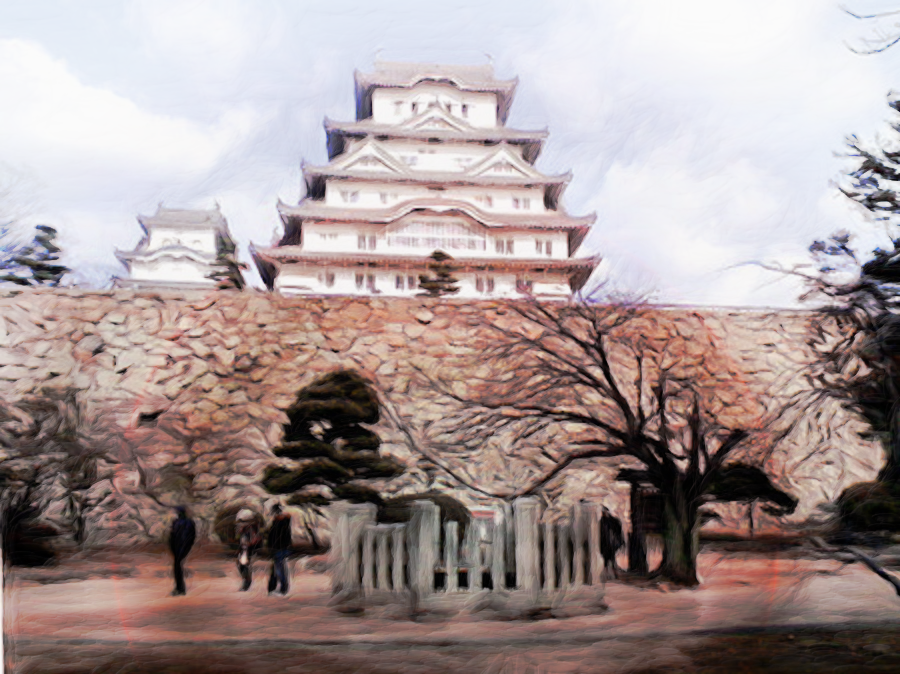
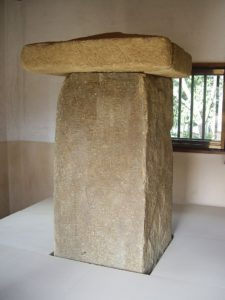
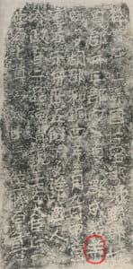

有名な姫路城のお菊井戸、播州皿屋敷。

しかし江戸にも番町皿屋敷あり。播州と番町のあいだで本家争いもあると聞く。じつはその他にも日本各地にたくさんの皿屋敷伝説が伝えられている。
いったいどこが「本家」なのか。そんな時は柳田國男に訊いてみるのがよい。柳田翁はまるで違った見解を示している。

> 小さい例でいうと番町の皿屋敷、あれは私などのくにでは播州皿屋敷といい、現に井戸もありお菊虫もいる。口拍子が似ているから作者があって、番町の方へ捲き上げられたものと皆考えている。ところが同じ言い伝えは土佐の幡多郡にもあり、また長州にもある。…そうすると関東方は頗る歩が悪いように思われるが、何ぞ知らんや上州妙義山麓の小幡一族には、ちゃんと足利時代からの同種口碑があって、信州松平藩の小幡家をはじめ、この一門の移住先では多くその怨霊を祀っていた。主人または主婦が惨虐で、召使の美女が怨みを含んで死んだという点は皆同じで、おまけにその幽霊の名は必ずお菊であった。
>
> 柳田國男「伝説」（新全集１１巻、定本５巻）

柳田國男はお菊井戸の起源が上州の小幡氏にあると指摘している。
事実、松平氏が転封で姫路藩主となった時、家来として来た小幡修理なる人物があり、小幡邸のあった五軒邸あたりにもともとお菊井戸があったらしい（今は城内にあるが、お城の中だと皿屋敷の話と辻褄が合わない）。

日本各地のお菊井戸も多くは小幡氏との関係がたどれる。
松平は国替えで、姫路から埼玉行田に移るが、確かに行田にもお菊伝説がある。まるで貞子のビデオのように次々と伝播している。
永久保貴一さんという漫画家が自力で調べて、お菊井戸が小幡氏よって伝播したことにたどり着いておられます。
■[永久保貴一『検証 四谷怪談 皿屋敷』～永久保さんの実証がステキｗ～](http://blog.goo.ne.jp/kitsunekonkon/e/0c877461816d7a29ef4ef9597093824a)

＊

さてその上州の小幡氏。これがなんとも不思議な伝説に彩られた氏族。
現在の群馬県甘楽郡近辺、妙義山から秩父銅山のあたりが本拠地。先祖は多胡（小幡）羊太夫という。ゆるキャラのような名前だが、たくさんの伝説を残している。
■[多胡羊太夫 – Wikipedia
](https://ja.wikipedia.org/wiki/多胡羊太夫)■[多胡碑と羊太夫伝説に関する文献目録](http://www.furutasigaku.jp/jfuruta/simin10/hitujimo.html)

この羊太夫、けっして単なる伝説上の人物ではない。多胡碑という８世紀の石碑にその名がちゃんと刻まれている。
■[多胡碑 – Wikipedia](https://ja.wikipedia.org/wiki/多胡碑)

この地は銅の産地で、渡来系の人々が採掘に関わってきた。
平城京遷都と合わせるように、良質な和銅が見つかり、年号を和銅と改め、和同開珎が鋳造されたのは、日本史の教科書にも出てくる。その際、多胡郡を新たに作り、その地を羊に賜われた。その記念が多胡碑である。小幡氏はその末裔。

伝説上でも、羊太夫は京に銅を運んだと伝えられている。
八束小脛という俊足の従者がいて、丑の刻に出発すれば未（ひつじ）の刻には京に着いたという。小脛の足には羽根が生えていて、飛ぶように駈けることができた。
ある時いたずらに羊太夫が小脛の足の羽根を抜いたため、俊足が失われ、そこから太夫の没落が始まる。謀反を疑われ、討伐され、最後は黄金の蝶となって空に消える。

華々しく歴史に登場した和同開珎だが、その後はかばかしくなく、伝説においても、銅山と中央政権のあいだで不和が生まれた気配が漂っている。のちの将門の乱につながるような関東開発者の不穏な動き。そして討伐。

しかし、羊太夫の不思議はこの程度では収まらない。

＊＊

銅採掘は渡来人の技術。この地域が甘楽（かんら）郡と呼ばれるのも、韓（から）にちなんだものといわれている。

江戸後期、平戸藩主にして稀代の好事家、松浦静山。
彼の著した「甲子夜話」に、多胡碑について驚くべき情報が記されている。
多胡碑の下から十字架が発見され、ＪＮＲＩ（ユダヤ王ナザレのイエス）と刻まれた銅のプレートが見つかったと。
静山たちはＪＮＲＩの意味がわからず、異人さんに訊ねたりもして、妙に真実味があったりするのも面白い。

例の秦氏とネストリウス派キリスト教を結びつける話のバリエーションがこんなところにも顔をのぞかせている。すでに徳川時代、このネタで盛り上がっている好事家たちがいたのだ。
十字架もＪＮＲＩプレートも現在は見当たらず、静山も人づてに聞いた話として記すのだが、お菊井戸を掘り下げると、ネストリウス派まで到ったわけだ。

＊＊＊

足に羽根の生えた従者の八束小脛。
柳田國男は零落したダイダラボッチの最終形態だと指摘している。
妙義山麓のこの地域。妙義山はダイダラボッチが築いたとも、寝転がった時の足置きとも言われている。山頂の巨岩に穴があいているのは、巨人・百合若大臣が矢で貫いた跡（なぜか百合若がダイダに重ねられている）。
そもそも八束脛は、八束という長い長い脛の持ち主、つまり京まで一跨ぎできる長い足の巨人（ダイダラボッチ）だったはずだが、小脛とされ、やがて俊足も失って、この地域のダイダラボッチ伝説の滅びを体現している。

＊＊＊＊

さてお菊伝説に戻ると。
原点のこの妙義山麓の地域では、もっと無残な形をしている。
主人の食事に針を仕込んだと疑惑をかけられたお菊は、蛇とムカデを詰め込んだ樽に入れられ、井戸に投げ込まれるのだ。
■[宝積寺　お菊の墓](http://www.japanmystery.com/gunma/housyakuji.html)
しかし、これはたんなる残酷物語ではない。蛇は水神、ムカデは秩父銅山の神、樽はウツホ。本来は悲劇ではなく、神性を帯びた物語。

蛇とムカデ、水の女神と銅（鐘）の組み合わせは、じつは俵藤太伝説とも、また道成寺縁起ともつながっている。
藤太＝藤原秀郷はこの地域の隣、下野の長。鏡に写ったおのれの姿のような平将門を討つが、彼自身も中央政権に楯突いたダイダラボッチであった。
この件はまた別な機会に。