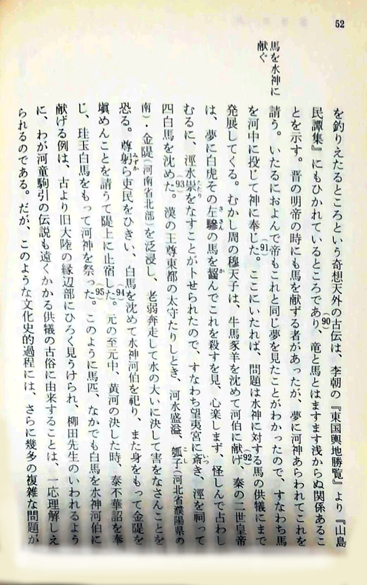
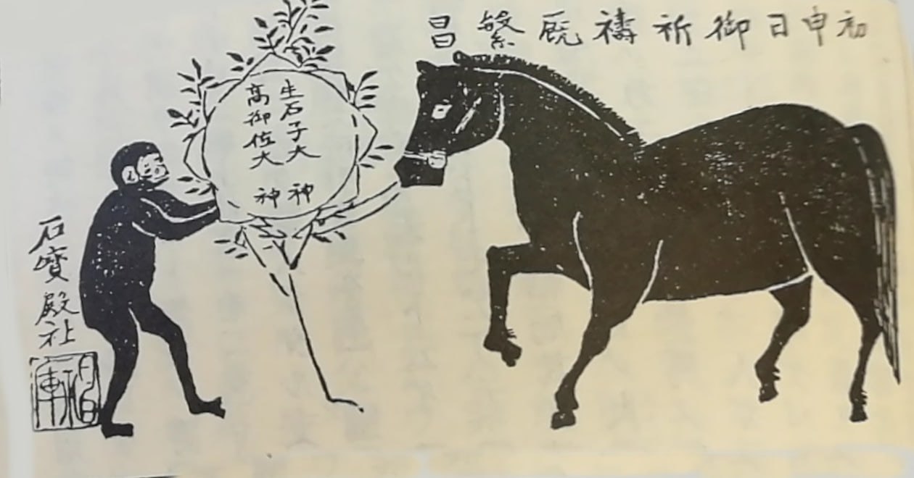

## 河童と瓢箪

福岡では川のそばに竿を立て、ヒョウタンを飾る風習がある。  ヒョウタンは水難避けのお守りで、河童と深く関係するもの。

<blockquote class="twitter-tweet" data-lang="ja">
赤いひょうたんが目に留まって寄り道。近くで黄色いひょうたんも見つけました。<a href="https://twitter.com/hashtag/%E7%A6%8F%E5%B2%A1?src=hash&amp;ref_src=twsrc%5Etfw">#福岡</a> <a href="https://twitter.com/hashtag/%E7%AD%91%E5%BE%8C?src=hash&amp;ref_src=twsrc%5Etfw">#筑後</a> <a href="https://twitter.com/hashtag/%E5%B7%9D%E7%A5%AD%E3%82%8A?src=hash&amp;ref_src=twsrc%5Etfw">#川祭り</a> <a href="https://twitter.com/hashtag/%E4%BA%94%E7%A9%80%E8%B1%8A%E7%A9%A3?src=hash&amp;ref_src=twsrc%5Etfw">#五穀豊穣</a> <a href="https://twitter.com/hashtag/%E6%B0%B4%E9%9B%A3%E5%9B%9E%E9%81%BF?src=hash&amp;ref_src=twsrc%5Etfw">#水難回避</a> <a href="https://twitter.com/hashtag/%E3%82%AB%E3%83%83%E3%83%91?src=hash&amp;ref_src=twsrc%5Etfw">#カッパ</a> <a href="https://t.co/avsoMahlZI">pic.twitter.com/avsoMahlZI</a>
&mdash; ぎえもん (@g_giemon) <a href="https://twitter.com/g_giemon/status/1135144796262060033?ref_src=twsrc%5Etfw">2019年6月2日</a></blockquote>

その由来はとても古くて、すでに日本書紀に二箇所ばかり登場する。

ひとつ目は仁徳天皇十一年10月、茨田堤という大規模な堤防工事のエピソードとして。[Wikipedia「茨田堤」](https://ja.wikipedia.org/wiki/%E8%8C%A8%E7%94%B0%E5%A0%A4)から引用すると。

> どうしても決壊してしまう場所が2か所あり、工事が難渋した。このとき天皇は「武蔵の人コワクビ（強頸）（无邪志国造#子孫参照）と河内の人の茨田連衫子（まむたのむらじころもこ）の二人を、河伯（川の神）に生贄として祭れば成功する」との夢を見た。そこで早速二人が探し出され、それぞれの箇所に1人ずつ人柱に立てられることとなった。コワクビは泣き悲しみながら入水していったが、コロモコはヒョウタンを河に投げ入れ、「自分を欲しければ、このヒョウタンを沈めて浮き上がらせるな。もしヒョウタンが沈まなかったら、その神は偽りの神だ」と叫んで、ヒョウタンを投げ入れた。もちろんヒョウタンは沈まず、この機知によってコロモコは死を免れた。結果として工事が成功した2か所は、それぞれコワクビの断間（こわくびのたえま）・コロモコの断間（ころもこのたえま）と呼ばれた。

ヒョウタンは水に浮く。河童はこれを沈めることができず、河童の天敵のようなものとして、ヒョウタンが捉えられている。

淀川にあった茨田堤。近くには「秦川勝の墓」とされるものもあり、堤の工事にあたった秦の部民の子孫が、のちの秦氏の大立者である川勝を祀ったものと思われる。  
「川の勝（すぐり）」と読める名を持つ秦川勝は、桂川では葛野大堰という大堰堤を建設した。どちらも川を分流させて、広大な灌漑農地を生み出す手法。

さて、書紀に見えるふたつ目の例も同じような話。これまた仁徳天皇の67年の条、[Wikipedia「蛟（みずち）」](https://ja.wikipedia.org/wiki/%E8%9B%9F)から引用すると。

> 吉備の中つ国（後の備中）の川嶋河（一説に現今岡山県の高梁川の古名）の分岐点の淵に、大虬（竜）が住みつき、毒を吐いて道行く人を毒気で侵したり殺したりしていた。そこに県守（あがたもり）という名で、笠臣（かさのおみ）の祖にあたる男が淵までやってきて、瓠（ヒサゴ）（瓢箪）を三つ浮かべ、大虬にむかって、そのヒサゴを沈めてめせよと挑戦し、もし出来れば撤退するが、出来ねば斬って成敗すると豪語した。すると魔物は鹿に化けてヒサゴを沈めようとしたがかなわず、男はこれを切り捨てた。さらに、淵の底の洞穴にひそむその類族を悉く斬りはらったので、淵は鮮血に染まり、以後、そこは「県守淵（あがたもりのふち）」と呼ばれるようになったという。

こちらも瓠（ひさご＝ヒョウタン）を水に沈めることができず、河童の弱みとして利用されている。  
吉備中つ国の「大虬」の住む淵は、おそらく真備町のあたり。数年前、水害に見舞われた地域。秦（はだ）の地名もあり、湛井堰という古代の堰堤もある。  
ミズチは水害を象徴し、堤の造成や分流の掘削など治水工事とヒョウタンが結びついている。

「河童とヒョウタン」は民話としても広く流布する。内容も、河童にヒョウタンを沈めるよう挑んで、ぎゃふんと言わせる話で、書紀と同じタイプ。  
書紀の話が起源というよりも、この型の伝説が治水灌漑工事をおこなう民に広く知られていたと考えることができる。

## 史記・河渠書の「瓠子決」

さて、われわれは河童と治水の関連、ふたつをつなぐキーワードとして「ヒョウタン（瓢、瓠、匏、ひさご）」を手に入れた。このキーワードを携えて、中国の古典を訪ねてみよう。

史記・河渠（かきょ）書。河川の治水工事について記したもの。  
ここに「瓠子決」というものが登場する。「決」とは決壊した場所のこと。もともとは黄河の瓠子堤・瓠子口という取水口だったが、漢の武帝のとき、決壊して二十数年ほったらかしに。これをふたたび堤に戻す大工事の件。

> 自河決瓠子後二十餘歲，歲因以數不登，而梁楚之地尤甚。天子既封禪巡祭山川，其明年，旱，乾封少雨。天子乃使汲仁、郭昌發卒數萬人塞**瓠子決**。於是天子已用事萬里沙，則還自臨決河，**沈白馬玉璧于河**，令群臣從官自將軍已下皆負薪窴決河。是時東郡燒草，以故薪柴少，而下淇園之竹以為楗。
>
> 天子既臨河決，悼功之不成，乃作歌曰：「瓠子決兮將柰何皓皓旰旰兮閭殫為河！殫為河兮地不得寧，功無已時兮吾山平。吾山平兮鉅野溢，魚沸郁兮柏冬日。延道弛兮離常流，**蛟龍**騁兮方遠遊。歸舊川兮神哉沛，不封禪兮安知外為我謂河伯兮何不仁，泛濫不止兮愁吾人齧桑浮兮淮、泗滿，久不反兮水維緩。」一曰：「河湯湯兮激潺湲，北渡污兮浚流難。搴長茭兮沈美玉，**河伯**許兮薪不屬。薪不屬兮衛人罪，燒蕭條兮噫乎何以御水穨林竹兮楗石菑，宣房塞兮萬福來。」於是卒塞瓠子，筑宮其上，名曰宣房宮。而道河北行二渠，復禹舊跡，而梁、楚之地復寧，無水災。

「瓠子、蛟龍、河伯」とおなじみの語彙が並び、これらが治水の堤防工事と深く関係していることがわかる。

さて、この工事において、「白馬玉璧を河に沈める」ことで決壊場所を塞ぐ様子が述べられている。  
雨乞いのために牛馬の生贄を捧げる風習はアジアでは広く見られる。そこで、史記の解説や、河童について書かれた文章でこの箇所を引用するものも、これは白馬を生贄として沈めたものと解説されている。司馬遷自身もそう解釈していたかもしれない。  
石田英一郎「河童駒引考」にも言及があるが、やはり白馬を「生贄」として理解している。

しかし、この「馬」はじつは生贄ではない。  
古代中国の治水技術は非常に高度なもので、そのうちのひとつに「馬」と呼ばれるものがある。

## 馬、牛、テトラポッド

ペシャワール会の中村哲さんは、アフガニスタンの乾燥した大地を農地に変えるべく、大規模な用水建設に尽力した。  
その際、工事の手法として参考にしたのは、福岡の筑後川にある山田堰。江戸時代に築かれた灌漑設備。  
堰堤にかかる水圧をゆるめながら、斜めに分流させて用水を取る手法。蛇篭と呼ばれる、石をカゴに詰め、レンガのように積んで、堤を構築する手法など。

蛇篭は「牛」とか「牛枠」と呼ばれる技術の応用で、この治水技法の起源ははるか紀元前３世紀、秦の時代にまで遡ることができる。  
都江堰という、中国四川省、岷江に作られた巨大堰堤がそれにあたる。今も現役の灌漑設備。

古代の東アジアの繁栄はこの技術がもたらしたのではないかと思えるような、すばらしい水利灌漑の手法。  
複数の天才的なアイデアが組み合わされていて、技術の蓄積は都江堰よりももっと遡ることができるにちがいない。

分流させるやり方も、現在のサイクロン式掃除機のような方法で、石や砂利を取り除いて用水にあてるなど、驚異的なアイデア満載なのだが、今回注目すべきなのは「榪槎」。  
木偏に馬。三本の木を組み合わせてテトラポッド状にし、その枠内に篭に詰めた石（蛇篭）を固定して、急流に対抗できる堤防を築く。  
中国では馬だが、日本では牛とか牛枠と呼ばれる。甲斐のあたりでは、なぜか武田信玄公が発明したことになっていたりもする（これにはかなり深い意味がある）。

史記・河渠書に戻ると、そこに記された「白馬玉璧」とは、榪槎のことであるのがわかる。この「馬」を河に沈めることで、堤防を築くことができるわけだ。

## 河童駒引新考

ここまで話を進めてみると、河童駒引と呼ばれる伝説について、榪槎とつなげてみたいという発想が湧く。

河童は、治水工事と深く関係しており、そもそもは水神（蛟）ではなく、水利工事をおこなう部民自身であったものが、川水とたわむれるうち、水神とごっちゃになってしまったものかもしれない。馬を引くのは猿の場合もあるが、猿は馬の味方で河童は敵という形になっており、これも工事人夫と水神の混同のせいかとも思える。  
ともあれ、河童は馬を川に引き込む。それは生贄ではなく、治水工事の作業そのものであり、河童（工事人夫）が「馬」と呼ばれる木枠を引いていく姿が残響しているものであると。

河童駒引の伝説は、河童が馬を水に引きずり込むことのほかに、河童の片腕が抜けて、それを取り返すために河童が人間に秘薬の製法を伝えるといったエピソードが加わる。ベオウルフの怪物グレンデルを彷彿させる話。工事は過酷な作業なので、脱臼や骨折、擦り傷切り傷は頻繁だったから、ケアも発達していたのかもしれないと考えたりもする。今の日本でも牛枠は使われているはずなので、実作業を見てみると何かヒントはあるかもしれない。

河童の伝承が、治水工事のおこなわれた地域にあることは明白で、早くから指摘がある（千葉徳爾「田仕事と河童」）。とくに堰の工事に関わることも示されている（永田恵十郎「灌漑社会とかっぱ」）。
家康は江戸の開発のため、運河や掘割、水道など、水回りの大規模工事をおこなったが、江戸の運河や堀と河童の濃厚な関係も指摘がある（中村禎里「河童の日本史」）。日本中から動員しておこなわれた工事。  
河童の伝承は、日本列島の妖怪伝説としてはもっとも広く多く見られるもので、とくに近世になってその傾向は顕著と考えられる。江戸の水利工事の動員がそのもとにあるのだろう。

河童はよく研究されている妖怪だが、「榪槎」のことだけはなぜかこれまで指摘がなかったので、この小文を書いてみた。