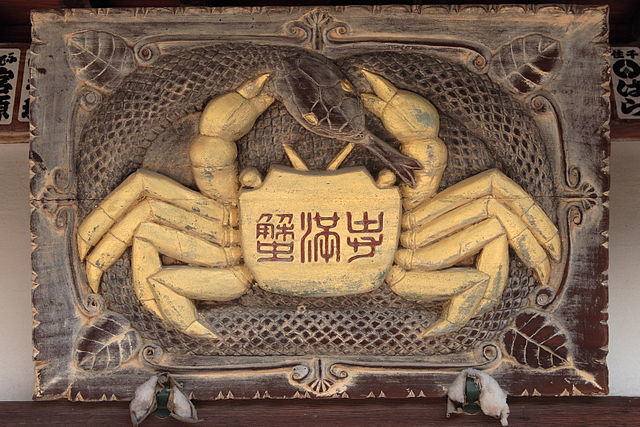

## 蟹の恩返し

秦氏を追う旅を続けよう。  
今回訪れるのは蟹満寺。京都府木津川市山城町綺田。綺田はカバタと読む。  
蟹満寺も「綺幡寺、蟹幡寺、加波多寺、紙幡寺、蟹満多寺」などと表記され、カムハタ、カミハタが本来の読み方らしい。秦氏創建と伝えられる。  
■[蟹満寺（京都風光）](http://www.kyotofukoh.jp/report812.html)

蟹満寺は今昔物語集などにある「蟹の恩返し」の舞台。あらすじは以下の通りだが、例によって蛇にまつわる秦神話のバリエーションである。  

> #### 今昔物語集巻16第16話「山城国の女人、観音の助けによりて、蛇難を逃れし話」（→[原文](http://yatanavi.org/text/k_konjaku/k_konjaku16-16)）
>
> 山城国久世郡に住む女は七歳で観音経を読み、十二歳で法華経を習うほど、信心深かった。  
> ある時、女は、蟹に紐を結んで弄ぶ者を見かけ、その蟹をくれたら、家の魚を上げますと言って、蟹を助け、川に放した。  
> 女の父は田で働いている時、毒蛇が蛙を呑み込もうとするのを見て、「その蛙を放してくれたら、お前を娘の婿にしよう」と口走ってしまう。蛇は彼の顔を見て、蛙を捨て、藪に消えた。  
> 馬鹿なことをしたものだとものも食べず嘆いている父から話を聞いて、なぐさめる娘。  
> その夜、亥の時に、戸を叩くものがある。蛇に違いないと娘に言うと、娘は「三日後に来るよう伝えてください」と。父が門を開けてみると、五位の姿のものが立っている。「今朝の約束どおりやって来た」という。父が三日後に来るように言うと、男は帰っていった。  
> 女は分厚い板で囲った「倉代」を作り、その中に入った。「今夜、蛇が来たらすぐ家の門を開いてください。私には観音様のご加護がありますから」  
> 初夜を迎え、五位のものがやってくる。門を叩き、家に入ると、女は倉代に立てこもっている。蛇は怒り、正体を見せて、倉代に巻き付き、尾で入り口を叩く。父母はこれを聞いて、大いにおびえた。  
> 夜半になると、叩く音がしなくなる。蛇の叫びが聞こえ、音が途絶える。  
> 朝になってみると、大きな蟹をカシラとして、千万もの蟹たちが、蛇を切り殺していた。蟹の姿もすでにない。女は、「観音経を唱えていたところ、美しい僧がやって来て、恐れることはない、蛇退散の経文を唱えなさい」と告げたという。観音のご加護によって難を逃れたのであった。  
> その後、蛇を埋め、蟹を讃えて、この地に寺を立て、仏像を造り、経典を納めて供養した。蟹満多寺、紙幡寺である。観音の霊験は不可思議なことである。  

今回は、仏教が入ることで、秦神話がどのように変形するかを見ていく。  

## 秦神話のプロトタイプ

その前に、秦神話のプロトタイプのようなものを想定しておきたい。  
神話とは、具体的なものを通じて、抽象的思考を（無意識のレベルで）展開していくもののひとつだ。  
秦神話の原型は、「田植え」と「男女の交わり」というふたつの系列を互いに見立てあいながら、稲にコメが宿る不思議、男と女の神秘について解読していく試みといえる。  
儀礼としては田植えの時期に雷神を呼び寄せる雨乞いの田楽であり、また「稲妻」という言葉にこの神話的思考はよく結晶している。稲の夫（ツマ）は雷である。  

田楽では、高足という片足の神（＝雷）が大地を跳ねることで、神話的結婚を表している。梅雨の時期に植えた稲（早乙女）が、雷とまぐわうことで、コメという子を宿す。稲作の不思議を男女の交わりに見立てながら（また逆に男女の交わりの不思議を稲作に見立てながら）、理解を深めていく。  



稲作と男女の交わり。2つの系列が見立て合いの関係にあり、稲作とは雷と稲の結婚として理解される。  

| 男   | 女   |
| ---- | ---- |
| 雷   | 稲   |

さらに「蛇（竜）」と「水（井戸）」が思考を支援する。2つの系列に流れる神秘を、「蛇＝水」で表現する。「蛇＝水」は不変項で、その神話が強調したいと考えている場所に、「蛇＝水」が宿ると言ってもいい。  

| 蛇（竜） | 水（水田、井戸） |
| -------- | ---------------- |
| -        | -                |

雨は天から降る水、井戸は地を流れる水。天と地という対立項は、「水」という不変項を媒介にして、同一化する。男女という対立項が、結婚によって結ぶように。  
雷神 – [水] – 井戸

神秘は「男＝雷」に宿ることもあれば、「女＝稲」に宿ることもある。  
雷神の足（男根）が竜で表される神話が存在する一方で、[野口神社の汁かけ祭り](http://overcube.com/wordsout/2017/02/21/京の井戸に封印されしものー秦氏の痕跡を神話論/)や道成寺縁起がそうであるように、女が蛇になることもある。さらには、トコロテンのような姿で生まれた行基の出生譚、蛇（へその緒）を頭に巻きつけて生まれた道場法師の出生譚のように、「子」もまた蛇で象徴されうる。神話が強調したい項に「蛇」は宿る。  
男 \  
子 – [蛇]  
女 /  

| 男   | 雷神としての竜                       |
| ---- | ------------------------------------ |
| 子   | 野口神社の蛇、道成寺縁起             |
| 女   | 同情報誌や行基（ところてん）の出生譚 |

蛇または水という不変項を、男、女、子に移動させることで、神話のバリエーションが作られていく。  

## 仏教の侵入

野口神社の祭りでは、蛇が女を表象するものになっていた。  
男はもはや雷神ではなく、役行者になったためだ。仏教によって、古い神話の一部が上書きされ、古い神話の威力を表わす蛇は女のほうに移り、役行者は仏教という新たな力をもって、古いものを調伏する。結婚の主題が反転し、調伏になっているのだ。  
仏教が性愛を厭うゆえ。  

| 男     | 女   |
| ------ | ---- |
| 雷＝蛇 | 稲   |

| 男               | 女       |
| ---------------- | -------- |
| 仏教僧（役行者） | 井戸＝蛇 |

プロトタイプでは性愛に肯定的でおおらかな笑いに包まれていた神話は、仏教を導入し、性愛を抑圧することで、蛇におどろおどろしさが強まっている。フロイトが「不気味なもの」で論じたように、抑圧されたものの回帰はホラーとして現れる。  

## 蟹のハサミが切断するもの

蟹満寺に戻ろう。  
「蟹の恩返し」譚では、蛇は男性であり、女に結婚を迫っている。  
物語のトーンは結婚を阻止することにあるが、女が分厚い板囲いの「倉代」にこもるのは、むしろ妻問婚でわざと男を遠ざけてみせる儀礼（妻籠みの八重垣）の痕跡をとどめていて面白い。本来は結婚譚だったのだ。  

役行者のような仏教僧の場所が空席なので、調伏を行う何かが必要となる。それが蟹。  
蟹はハサミで蛇を切断するが、それはあまりにもフロイト的な…つまり男根の切断を思わせる仏教的去勢。  
観音経を唱える女の夢の中では、蟹は「美しい僧」として現れている。秦神話を仏教が切断していく。  
思えば、前に取り上げた野口神社や京都烏丸では、秦の古い神である蛇は、巨石で封印され、今回は切断でバラバラに。ひどい目にあっているのだが、女蛇は穴に封印、男蛇は切断という、あまりに通俗フロイト的象徴に、仏教僧の抑圧された内面を見る思い。  

| （新） | 男   |
| ------ | ---- |
| 蟹     | 蛇   |

## 蛇の中絶

蛇が調伏されるという点でよく似た説話がある。  

> #### 今昔物語集巻24第9話「蛇に嫁ぎし女を医師治せる話」
>
> 河内国讃良（さらら）郡馬甘（うまかい）に、身分は低いが大いに富む家があった。  
> 4月ごろ、その家の娘が養蚕のため桑の木に登って葉を摘んでいると、大きな蛇が木に巻きつき始めた。怖くなって降りようとした娘にも巻きつき、女を淫した。木の下に倒れた女。泣き叫ぶ父母。医者を呼ぶが、女と蛇はつながったままだ。  
> 粟の藁を焼いて湯で汁を取り、猪の毛を合わせて、逆さまにした娘の女陰に注ぐ。ようやく離れた蛇を打ち殺し、さらに女陰に汁を注ぐと、猪の毛を立てた子蛇たちが湧いて出た。ようやく気を取り戻した娘は「夢を見ているようだった」と言う。  
> 娘は薬で命を永らえたが、三年後、蛇に淫されて死んだ。前世の宿縁で治すことはできなかった。
> 医師の力、薬の効能は、不思議なものである。  
> （→[原文](http://yatanavi.org/text/k_konjaku/k_konjaku24-9)）

この説話には、秦という名称こそ登場しないものの、秦氏を思わせるものがたくさんある。  

まず、舞台が茨田堤一帯の秦氏が濃厚な地であること。  
さらに地名を細かく見ていくと、「讃良（さらら）」は野口神社のある「蛇穴（さらき）」と通じ、「馬甘（うまかい）」はカム（甘）が本来で蟹満寺のあるカムハタに通じる。（蟹満寺と地理的にも数キロほどしか離れていない。）  

もっとも秦氏的であるのは、「身分が低いが大金持ち」というところ。  
秦氏の台頭は川勝よりも以前の秦大津父に始まる。馬による運送で伊勢と奈良や京都を結び、巨万の富を得た。馬甘もこの運輸ネットワークの一部なのだろう。馬の飼育や運送のような、本来は身分の低いものの仕事が、実際やってみると大儲けできた。渡来人由来のこうした長者の系譜はずっと後の時代まで続いていく。  

その上に、養蚕と桑である。これで秦氏でないわけがないだろうといいたくなる。  

この説話では「蟹」は登場しない。かわりに薬が蛇を調伏する。渡来系の人々が仏教だけでなく、薬師にもなりわいを求めたことが反映しているだろう。  

これと同じ話は日本霊異記にも載っている。そこでは「前世の宿縁」についても書かれている。  
女は前世では、子を愛しすぎる母であった。息子のマラを口ですすって愛した。何度生まれ変わっても二人は愛しあった。今回はそれが蛇と女であった。  
霊異記の作者は、仏教徒としての建前ではこれを否定しながらも、無意識ではこの話に惹かれているのが興味深い。  

＊  

今昔や霊異記のような仏教説話集のなかに、秦神話のバリエーションが多く埋もれている。仏教の到来によって古い神話が変換されていく過程を神話論的に分析することで「発掘」できるように思う。  
以上で、神話的思考が、不変項を媒介に対立を結びつけ、強調する項を移動し、不要な項を欠落させ、時に反転しながら、バリエーションを広げていく一端を示せたかと思う。  
神話は、ねじれながら元に回帰していくウロボロス、メビウスの輪としての蛇。  