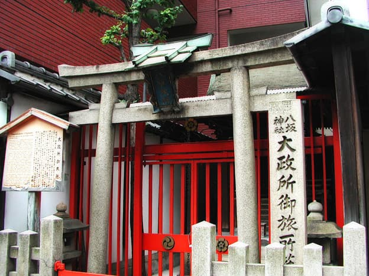
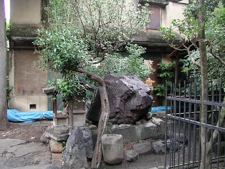

## 奈良・野口神社の秦神話

京都は平安京以前は秦氏のテリトリー。大内裏は秦河勝邸のあった場所に築かれたと言われている（拾芥抄）。
平安京の下に埋もれている秦氏の痕跡を探る前に、まず手がかりとして奈良県御所市蛇穴（さらぎ）の野口神社を訪れてみる。汁かけ祭という珍しい祭がある。  
彦八井命を祀る野口神社は、茨田堤を作った河内の秦氏の一部が移住した場所。大阪にはもう残ってない秦氏の古い神話が、野口神社の祭に名残を留めている。  
■[野口神社　御所市](http://www.asahi-net.or.jp/~pf8k-mtmt/norimono/touring/2007/choi2007/nogutijinjya.html)

葛城山で修行に励む役行者に一目惚れした女の執念が蛇となって暴れ回り、調伏されて井戸に封印されるという神話を、祭は再現している。藁で作った大蛇は、田植えの時期、町中を練り歩いたあと、神社の井戸に戻る。井戸には巨石が積まれ、水神である蛇が封印されて、蛇塚と呼ばれる。茨田堤という大堤防で暴れ川を治水した秦氏の歴史が刻まれてもいる。

少し細かい指摘をすると、役行者は新たに付け加えられた要素で、もともとは雷神がいて、通い婚の形式で井戸の女神と結ばれていた可能性が高い。仏教による調伏という主題が入って、男は古い神の性質を失い、それが女側に映って、荒ぶる蛇となっている。

## 烏丸通の井戸の女神
京都太秦にも蛇塚古墳があり、同様の祭が行われていたかもしれない。しかし。もっと別な場所、京都のど真ん中に秦氏の痕跡が埋もれている。



祇園祭で牛頭天王を載せた神輿が到来する大政所御旅所。井戸である。  
由来は秦助正なる人物（秦氏！）が、この地と八坂の祇園社の間に糸が通っているのを夢に見た由。  
三輪山型神話の変形になっている。通い婚のニュアンスは消え、糸も蛇ではなく蜘蛛の糸に置き換わり、蜘蛛塚または狐塚と呼ばれるものが大政所のそばにかつてあった。  
■[八坂神社大政所御旅所](http://www.kyotofukoh.jp/report355.html)

[](hanjoduka.jpg)

さて大政所のすぐ西に班女塚あり。巨石で封印された井戸（！）である。  
宇治拾遺物語に由来が描かれている。男が通ってくる家があったが、男が通わなくなり、女は死ぬ。女の遺体を葬場に運ぼうとするが、何度やっても元の家に戻ってくる。ゆえにここに塚を築いたと。  
■[繁昌神社・班女塚](http://www.kyotofukoh.jp/report885.html)

祇園の牛頭天王と烏丸の井戸の女神は通い婚の関係。祇園祭の神輿はそれを再現している。三輪山的な通いの糸も結ぶ。男側が荒神であるため、井戸の女神側は蛇となって暴れないが、巨石で封印される。  
大政所御旅所と班女塚の不可思議な伝承は、野口神社の祭を重ねあわせることで、秦氏の神話が平安京で解体変形したものと理解できる。班女塚には蛇がとぐろを巻き居座っていると幻視したい。  

## 【おまけ】大政所周辺の魔界ツアーガイド


大政所御旅所の周辺は不思議なものがいっぱいある。  
京の街のど真ん中。四条通と五条通に挟まれた烏丸通の近辺。高層オフィスビルもホテルも旅館もお店もびっしりある繁華街だが、同時に魔所でもあるという京都の不思議。  
六条御息所の生霊に取り殺された夕顔の家、丑の刻参りで知られる鉄輪の井戸、鵺を射殺した矢じりを祀る神明社、牛頭天王の荒御魂である元悪王子社などなど。怪異で知られる源融の河原院も近い。それらは能の題材でもある（夕顔、鉄輪、鵺、班女、俊成忠度、融…なんたる能密度！）。  
この密集は偶然ではなく、よい井戸の湧くこの辺りは、藤原氏の邸宅も多くあったし、平安京以前にはおそらく秦氏にとって意味のある場所で、その名残としてこうした遺跡が広い時代にわたって噴出してきた可能性がある。矢じりや鉄輪など鍛冶師との関わりも気になるところ。  
一時間もあれば全部を巡ることができる…とはいえ、あまり一度に全部は巡らないほうがいいかも。記念スタンプラリーならぬ魔の刻印ラリーが首筋に刻まれていきそうな。