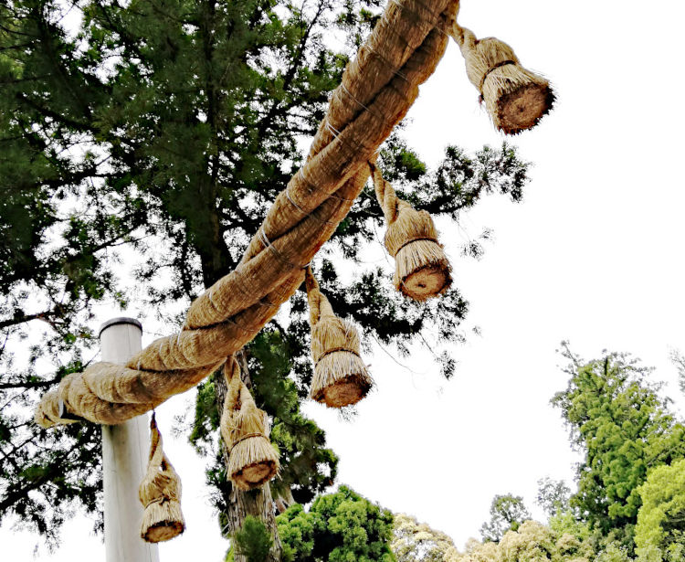
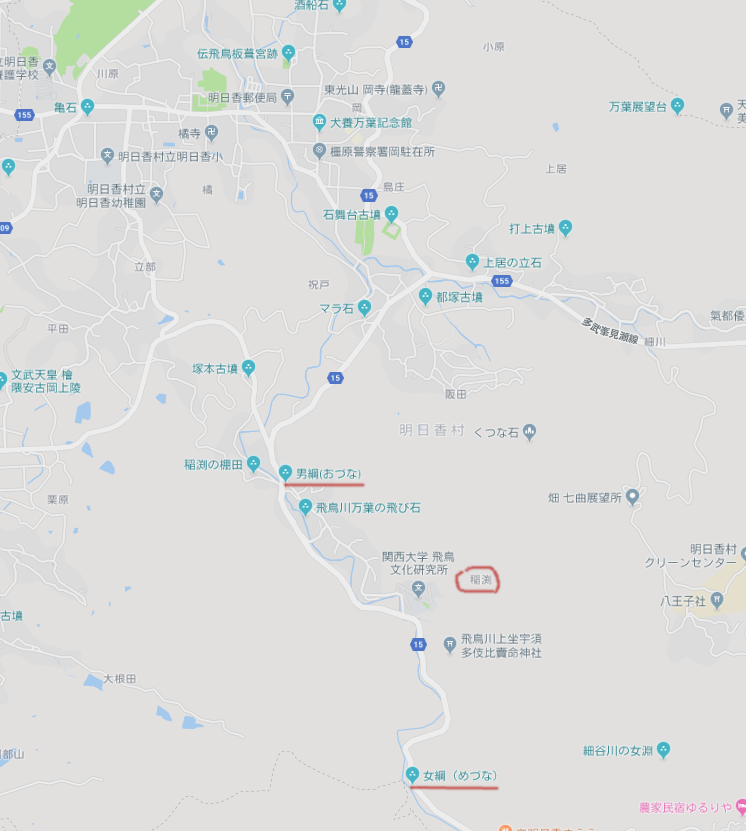
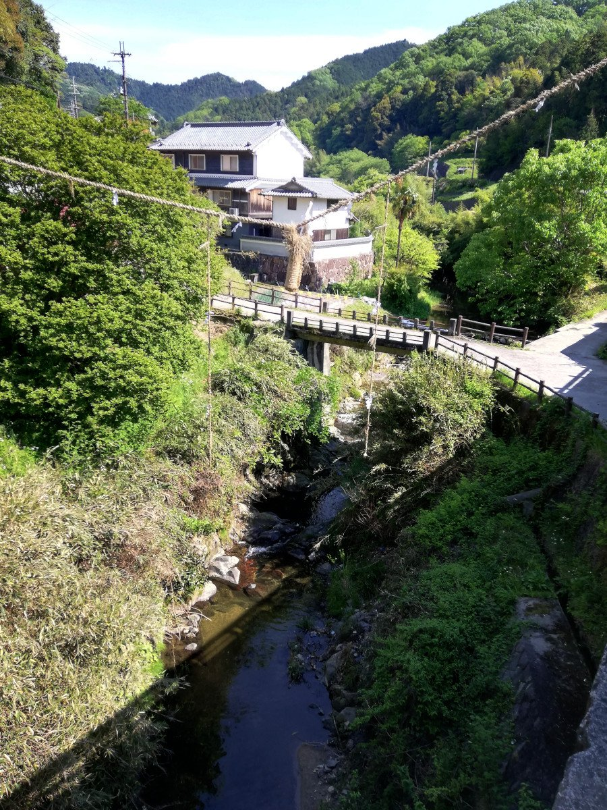
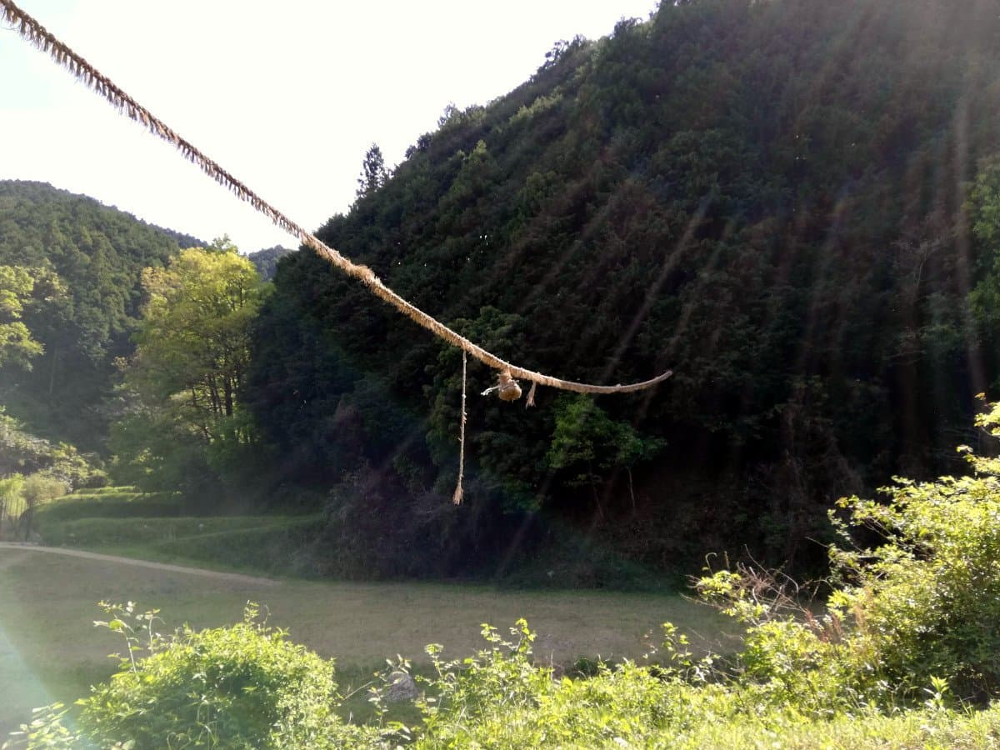
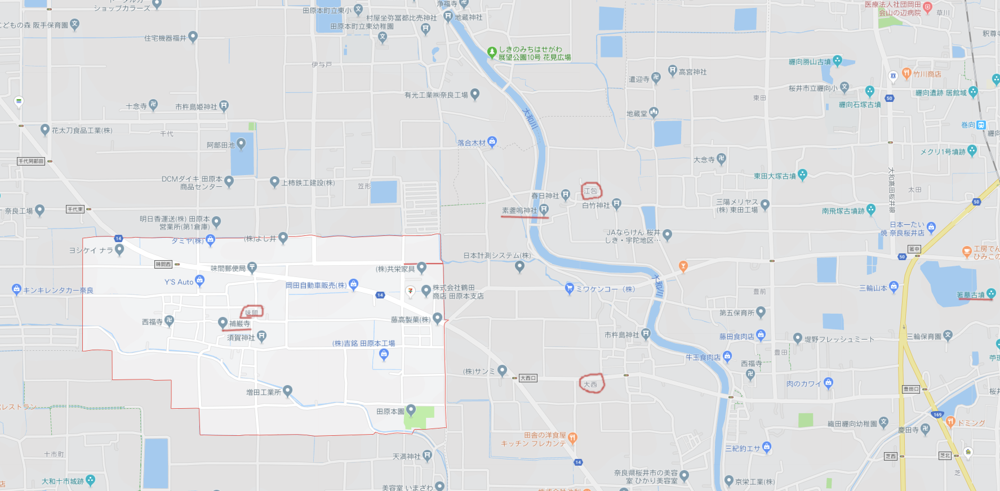
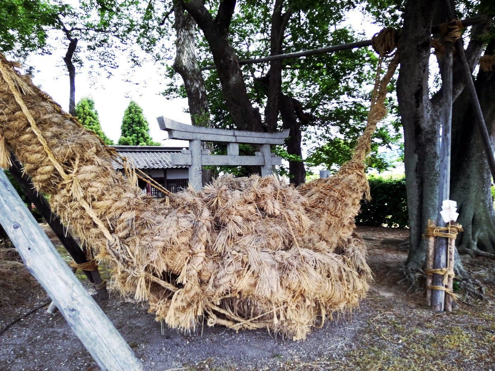
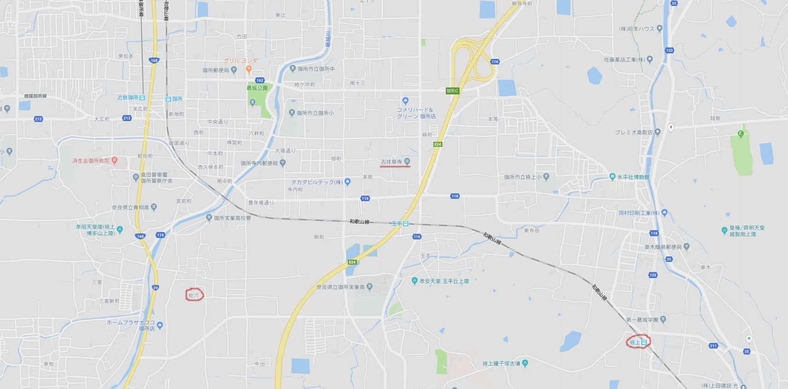

## 稲渕の男綱・女綱

そう。それは十連休の明けた5月の半ばのこと。  
所要もあって三日ばかり奈良方面を旅したのだが、これがまたしても異界への旅になってしまったので、その旅日記を書き留めておく。

そもそもは日帰りで法隆寺に行こうかと思い立ったのがはじまり（法隆寺に行ったことがないので）。  
しかし二年ほど前に秦氏やら観世親子やらにまつわる場所をたずね歩いた時、まだまわりきれていなかったところ（世阿弥の菩提寺の補巌寺など）があり、京都に用事も出来たので、も少し足を伸ばしてみようと二泊の旅を計画。  
ホテルも予約し終え、漫然とテレビを見ていると、NHKの新日本風土記で飛鳥の回をやっていた。まあ飛鳥に行くのも選択肢のひとつ、と番組を眺めていた。

飛鳥の南は南淵（稲渕）。小さな山岳渓流。  
棚田もあり、かつて皇極天皇が雨乞いを行ったことでも知られる。新日本風土記「飛鳥」では、その南淵の「男綱（おづな）女綱（めづな）」というものを紹介しており、これがいたく琴線（というより妖怪アンテナ）に触れるものであった。

で、京都での用事を済ませ、奈良に向かった私は、桜井駅でレンタサイクルして、まず稲淵を目指すことに。  
距離は10キロあまり。自転車には乗り慣れているので、レンタサイクルのママチャリとはいえ、まあ大した距離ではない。はずであった。

山岳。変速のないママチャリでこの坂を登るのは、かなりの荒行であった。  
しかもだ、上からはきらびやかなロードバイクに乗った一群が「下り、気持ちいー」などと極楽感いっぱいのたわごとをのたまいながら風を切って駆け下りていく。ジオス、キャノンデール、ビアンキ、フェルト。  
その横を空気の減ったママチャリでえっちらほっちら登る私に刺さる「なぜこの坂をレンタサイクルのママチャリで（冷笑）」な眼差し。私が浅野内匠頭なら彼ら彼女らの声のうちに「フナ侍」を幻聴して刃傷沙汰に至る状況だ。斬る斬る斬る。

そんな苦節小一時間のすえ、ようやっとのこと、男綱の張られた橋に到達。汗だくであるが、駅で買った麦茶のペットボトルはすでに空だ。

橋のそばにぶら下がっているのが、男性器を模した「男綱」さま。
これが注連縄などの起源なのだとすると、注連縄からぶらさがる幣などのものは、本来、生殖器を象ったもの、ということになる。祇園祭の粽（ちまき）なども、もともとはそうなのかもしれない。

しかし、男綱を見た以上は、さらに上の女綱を目指す。これがまた遠い。Googleマップ上ではたいしたことのない距離だが、いかんせん山坂である。バテバテである。ペットボトルは空なのである。

途中で、皇極天皇が雨乞いした場所とか、南淵請安の碑だとかが目に入るが、一心不乱に女綱を目指す。  
パンパンの太腿、乾ききった喉、滝のような汗。いったい私は何のためにこんな難行苦行を。雨はやだけど、喉をうるおす水はほしいと、雨乞い気分。  
たぶん、男綱と女綱が結ばれないと、雨は降らない。この苦行する私自身が、男綱から女綱へとつなぐ結び目なのだ。

もう引き返そう、男綱が見れたし、いーじゃん。という心のサイレンとの戦いに打ち勝ち、重いペダルを漕ぎづつけて、ついに女綱へ。

これも当然、女性器を模したもの。  
離れ離れの雌雄が、苦行のすえ、私の中で結ばれる。

湧き上がる達成感。ここで水が飲めれば最高なのだが、もはや脱水症状寸前である。私の眼の中で雌雄は結ばれた。すぐさま下りの途につく。

下り坂の楽勝さに勢いづいて、律儀に南淵請安碑や女帝の雨乞い地点もめぐって、快楽の下りへ。  
火野正平のいうとおり、人生、下り坂、最高。登攀時の脳内刃傷沙汰などすっかり忘れて、「下り、気持ちいー」（ママチャリだが）。

## 味間という地名

石舞台のあたりで一服して、水分もタプタプに補給し、次は補巌寺へ。  
補巌寺は観世親子の菩提寺で、味間というところにある。味間郵便局を目印にチャリを漕ぐ。  
菩提寺も味間なら、観世の邸があった田原本の駅近くの地名も味間町。徒歩15分ほどのすぐ近くなのに、同じ味間地名。

味間（あじま）は、秦川勝らに伎楽を伝えた百済人・味摩之（みまし）を楽舞の祖として、それにちなんだ地名らしい。  
しかし、なぜか漢字を読み間違えている。そんな大事な名前を読み間違えるには、それなりの理由があるのかもしれないが、よくわからない。同じく味摩之にちなんだ、琵琶湖南の敏満寺はちゃんとミマジと読んでいる（難読だけど）。ここも能の敏満寺座があった。  
味摩之が舞楽の始祖、なのだが、人物は忘れられ、読み間違いの地名が萬歳や傀儡によって日本各地に残った。

味間地名をつけることで、租税や労役の免除、通行の自由、寺社での興業・商売の権利など、何らかの特権が得られたのかもしれない。江戸時代の陰陽師が土御門の下で、家元制度みたい形で特権を得たように。  
そう、陰陽師と能などの舞楽は遡れば等号で結べる。  

さて、補巌寺。このあたりは川がそばに流れ、奈良でよく見られる環壕集落の名残りをとどめる、落ち着いたとても居心地のいい場所だった。かなり豊かであった時代が、おそらく複数回あっただろう気配。  
観世親子に関わるこの一帯は、最初の屯倉である「倭屯倉」のあった場所でもある（垂仁、景行天皇の頃と記紀はしるす）。この大田から稲穂をとって、ヤマト王権初期の大嘗祭新嘗祭はおこなわれていたかもしれない。

## 御綱さまとの出会い

かくして、最初の計画にあった男綱女綱と補巌寺をめぐりおえて、あとはのんびり、山辺の道の方面へでもと思い、特に具体的な目標は定めないまま、漠然と丑寅の方角にチャリンコを漕ぎ出した。

大和川が流れており、その岸をたどろうかと思った矢先。橋の欄干に得体の知れないものが巻き付いている。大蛇？  
藁で作った長大な蛇。蛇だと思う、そうとしか見えない。

欄干に巻き付く蛇をぬるぬる辿って橋を渡ると、その先に神社を発見。  
蛇はそこでもうねうねと木にまとわりつき、また下がって、うず高い藁の塊を作っている。よく見ると、その塊は結合した二匹の蛇。もう一方の蛇の尾がさらに向こうの方へと伸びている。  

男綱女綱を見てきたばかりなので、これが雌雄の結合した姿であるとひと目で直感した。

調べてみると、事実、この巨大な藁の結び目は、江包・大西の御綱と呼ばれるもの。  
お綱祭という嫁入り行事で、大西の雌綱が嫁ぎ、江包（えっつみ）の雄綱と契を結んで、まぐわったままの姿で素戔嗚神社の前に鎮座する。

祭の際には、路上を行く人に巻き付いてみたり（それが武士であっても逆らうことは許されなかった）、新婚宅で酒・ご馳走を強要したり、泥まみれになって相撲を取ったりといった狼藉を繰り返す。  
ディオニュソス＝スサノヲ的暴挙がハチャメチャ破天荒であればあるほど、その年の豊作が約束される。痴愚神礼讃の奇祭。  

## 観世、屯倉、邪馬台国

御綱さまに出会った衝撃はすさまじかった。  
さっき、南淵の雄綱雌綱を見てきたばかり。そこでは男女はずいぶん離れ離れで、きっと交わりというクライマックスがひそかに存在するにちがいないと思っていたところ、まさかその現場に出喰わすとは。

しかも、ここは観世親子ゆかりの地のつづき。  
能は、極度に洗練された様式の裏に（むしろその洗練の異常な極端さゆえに）、野生を感じさせるものがあるが、裏返しにして見出される生の秘部を目の当たりにしたような。

さらにまたここは最初の屯倉があった場所。  
のちに天皇という道教的名辞を名乗る以前、大王（おおきみ）の日々のニエを供えた大田（おおた）。

それにそもそも、邪馬台国はこのあたりだという説が、近年ますます有力になっている。  
纒向が邪馬台国だとしたら、卑弥呼が新嘗する大田がここだったので、のちの屯倉に引き継がれたのでは。 

そして、男綱女綱の結合こそが、大嘗新嘗として王家の統治システムに取り込まれ、洗練・象徴化、高尚・上品化したのではなかったか。  
そうなる以前の、素朴でワイルド、下品なまでに野生な、本来の稲作神話こそが、御綱さまではないのだろうか（あとで書くが、この驚きと同じものを昭和19年に感じた人がいることがわかった。その人は柳田國男）。  

## 蛇の穴

さらに。  
前の旅で行った、秦氏の初めの入植地として新撰姓氏録に記される掖上の地。秦はもとは葛城氏・鴨氏の部民であったかもしれない。この掖上から葛城山麓の地域に、蛇穴と書いてサラギと読む場所がある。このあたりは、役小角の故郷でもある（吉祥草寺が生誕地）。  

蛇穴で行われる蛇曳き汁掛け祭は、藁で作った長い蛇をめぐり歩かせ、井戸の上にトグロを巻かせて稔りを祈願するもの。つまり、御綱祭のバリエーションのひとつである。

これとよく似たものは田原本にもあるのだが、じつはそんなヌルいものではなくて、調べてみると奈良には数十箇所もこの手の祭がある。  
しかも、それぞれがちょっとずつ（かなり、の場合も）ちがっていて、豊かなバリエーションを形成しており、この祭の古さ、神話がみずから展開しようとする強い力を感じさせる。

奈良といえば、東大寺の大仏とか、春日神社の鹿とか、あるいは飛鳥とか、あおによし古都のおごそかなイメージなのだが、それとは全然別なもうひとつの顔、野生の顔がある。

ヨーロッパで、キリスト教の敬虔な表層の下に、ゲルマンの野生が隠されているのに、それは似ている。  
アルプスの麓では、サンタクロースのお供をする野人たちが今も狼藉を重ねている。あれと同じものを、まさか古都奈良で見出すことになろうとは。  
東北や沖縄など遠方をたどるまでもなく、まず足元、ど真ん中の、ヤマト発祥地に、こんな野生が生きて残っている。  
いにしえの神々はまだここでちゃんと生息している。播磨や吉備よりさえも、もっと濃厚な原液が現役である。  

おそらく、全国に分布するサイノカミのより原型に近い形が、奈良に残る藁の蛇の祭。  
中心により古いものが残るのは、柳田の方言周囲論のような考え方に矛盾するが、なぜそうなったかは、端的に説明が着くはずだ。中心（都）のほうが移動して離れていったのだ。  
現在の桜井市・橿原市あたりをうろうろしていたヤマト王権の宮は、結局、この地の狭苦しさ、氏族間の権力争いにうんざりして、去っていく。平城京、長岡京、そして平安京へと。  
取り残された「古都」。歴史を刻む時計は止まり、その片隅に古い古い伝統がひそかに生存したのである。  

しかし、なんでいつも、こういう旅になっちゃうのかしら。取り憑かれているとしか思えん。痴愚神、礼讃。法隆寺へ行ける日ははたしていつ。  

まだ、続きますから。

