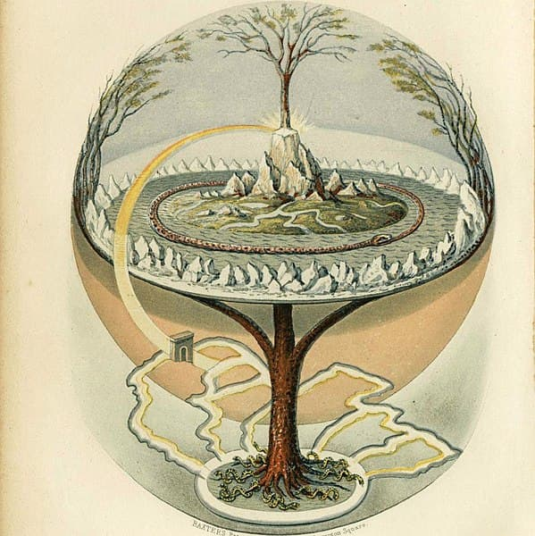

## 藁の蛇

自らの尾を噛んで閉じた円環をなすウロボロス。  
最大のウロボロスは、世界（ミッドガルド＝中つ国）を取り巻くヨルムンガンドだろう。北欧神話の巨大な蛇で、世界の終わり（ラグナロク）のとき、陸に侵攻し津波を起こす、と語られる。  
そのヨルムンガンドを奈良（大和）で見つけた、という妙な話をひとつ。

奈良というと、まずはJRや近鉄の奈良駅がある奈良市が思い浮かぶ。平城京のあった地域で、東大寺の大仏、春日神社の鹿など、修学旅行でもおなじみの界隈。  
その奈良から20キロほど南が、都を平城京に移す前、本来の大和と呼ばれた地域。三輪山の西、桜井市や田原本、さらに南や西の飛鳥・橿原、そして葛城山ふもとあたりまでの広がり。邪馬台国は近年、纒向近辺の可能性が高まっている。

[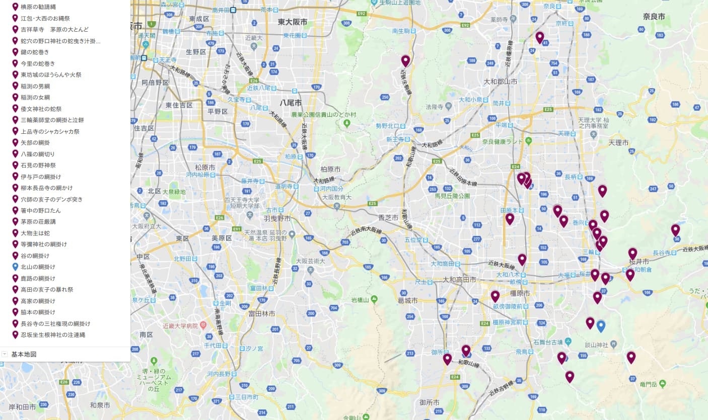](nogamimap.png)

この大和の地に、藁で作った蛇の祭が非常に多く見られる。野神とも蛇綱とも呼ばれる。いつから伝わるものかよくわからない。室町時代の文献を残すものもあるが、祭のもつ場違いなほどの野性味が、もっと古い起源を想像させる。地域ごとで祭に個性があり、このバリエーションが醸成される程度には古いとも言えるだろう。  
弥生時代、卑弥呼の頃にはすでにあったもの、という仮定も不可能ではない。稲作とともに古いのだと。それで説明できることが増えるなら、仮定を支持する傍証にはなる。

## 稲渕の男綱女綱―輪になる前の蛇

円環になる前にまず伸びている蛇を見てみよう。  
石舞台古墳から南に進むと山道になって山岳渓流が現れる。棚田で知られる稲渕。この渓流に男綱・女綱という、性器を模した蛇が掛けられている。渓流の南北、村境にあたるところに雄雌それぞれの綱が渡される。

[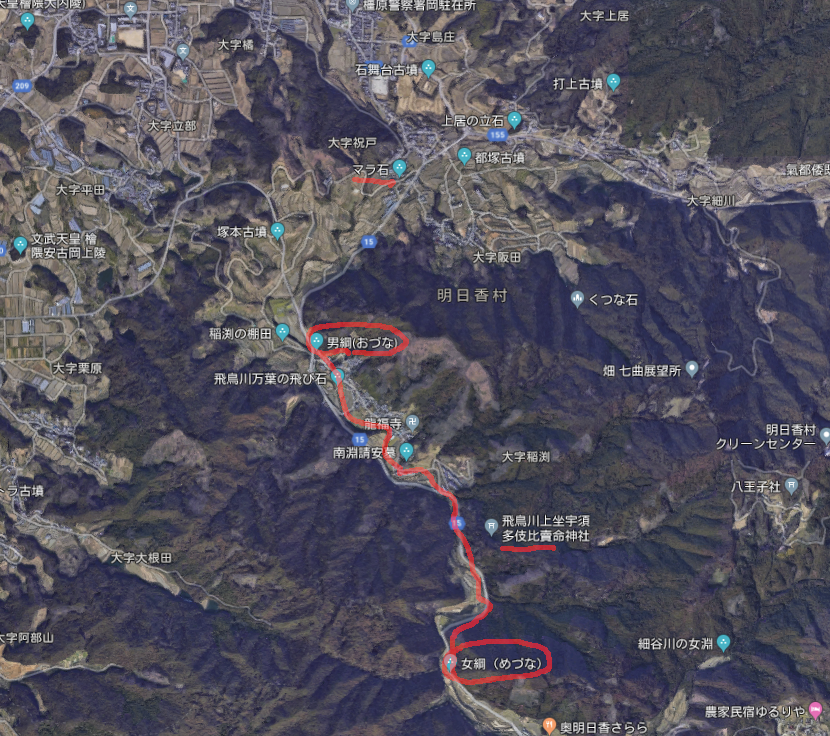](inabuti_map.png)

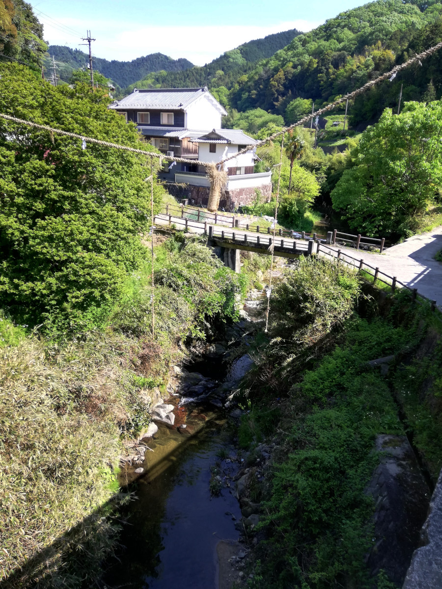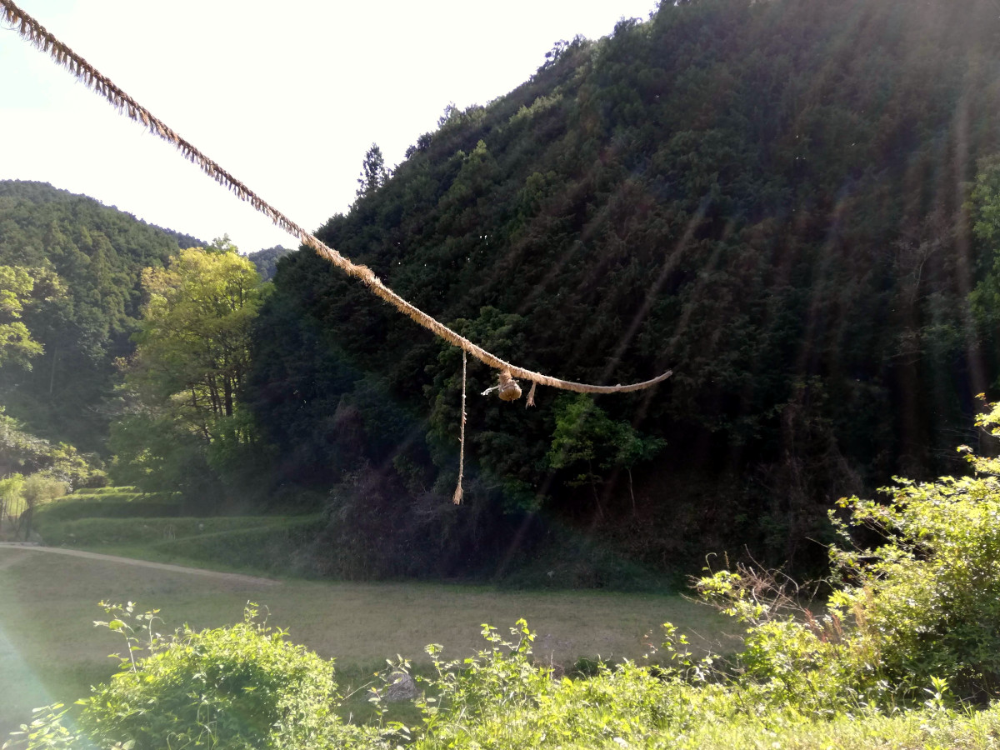

皇極女帝が雨乞をしたことでも知られる渓流。うねうねと伸びた川が蛇体に見立てられている。水と蛇の連関はよく知られた象徴である。  
ふだんは南北の村境に離れ離れの雌雄だが、これが交わることで雨を呼ぶことができる仕組み。書紀では、道教マニアの皇極天皇が仏教に対抗し四方拝をしたことになっているが、蛇と雨の伝承がより古いベースにある。

## ウロボロスの論理

このあと、輪になった蛇を見ていくことになるが、その前にウロボロスとは何か、その論理構造を考えてみたい。

始まり（頭）と終わり（尾）が一致し円環をなすことで、対立物の結合、反対の一致を示す錬金術の象徴となる。実際、錬金術では、ウロボロスとともに、両性具有の王＝后や、太陽と月の結婚といった、対立物の結合を示す図像が描かれる。ふだんは両極にあるものが合体することで、特別な力を生じるというのが、ウロボロスの論理である。表と裏という対立物が輪になって連続すれば、メビウスの輪になり、ウロボロスの論理の一環をなしている。
こうした現象のまたの名は「愛」である。

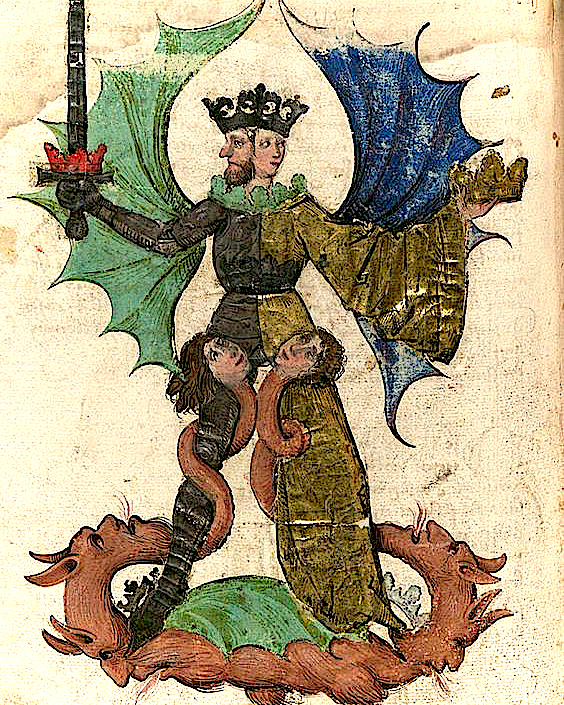
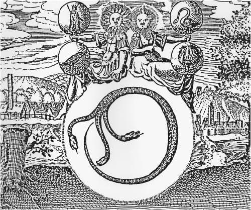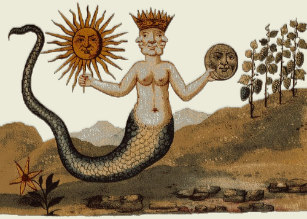

大和の藁の蛇も雌雄で表され、その結び目は反対の一致を象徴する。ムスビから生まれるのは、稲作のための水。雨であり、神格化すれば雷神がふさわしい。

水、蛇、愛。  
日本書紀や日本霊異記に登場する少子部スガル。雄略天皇と后のまぐわいを目撃したあと、三輪山の神である雷を、井戸で捉える。飛鳥の雷丘の由来譚でもあるこの話も、大和の藁蛇のバリエーション。  
対立物の結合としてのまぐわい（愛）、そして雷と井戸という水に関わるもの。三輪山の蛇。天と大地の結婚としての雷と降雨。

## 江包・大西の御綱−交わり続ける雌雄

大和の藁蛇（野神）祭でもっともでかく強烈な印象を残すのは、江包・大西の御綱祭。  
巨大な雌雄の蛇が、結合したままの姿で社の前に置かれている。稲渕の男綱女綱のように離れ離れでなく、祭のあとの日常の時も交わったままの姿。

なぜ結合したままのお姿なのか。  
その答えは環濠集落にある。稲渕で川の流れが蛇体に見立てられたのと同様に、ここでは村を取り巻く堀堤が蛇に見立てられる。そう、その姿はまるで、葦原中つ国を囲むヨルムンガンド。  

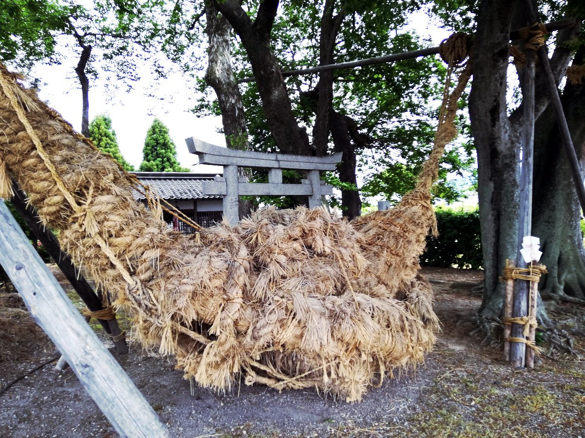

## 環濠集落を取り囲むもの

大和は環濠集落が驚くほど多い。その伝統は弥生時代から中世・近世まで続く。およそ村落を造成する際、そのまわりを濠で囲むことが、デフォルトの建設デザインだった。  
そして、水＝蛇の象徴的連関をよく理解していた人々にとって、川や濠を蛇に見立てるのは自然な発想であり、環濠は輪になった蛇とみなされたはずだ、というのが、この文章で提示する仮説。ミッドガルド（中つ国）を取り囲む巨蛇ユルムンガンドのように。  

田原本に唐古・鍵遺跡という弥生遺跡がある。その復元図は実際、蛇のように環濠や水路がのたうっている。ヨーロッパの石に刻まれたヨルムンガンドを並べてみる。  
唐古・鍵遺跡はまた、ヨルムンガンド津波ならぬ大洪水に見舞われ村が沈み、その後復元されたことが発掘でわかっている。  

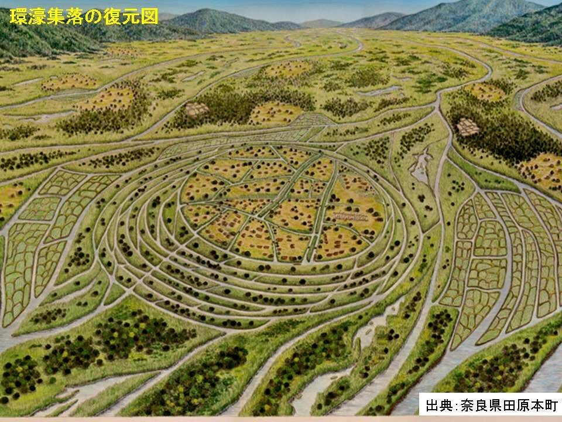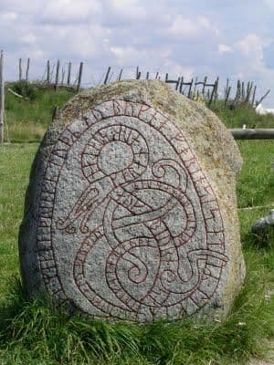

## 環濠の論理

よく保存されている環濠集落跡として、稗田阿礼の出身地とされる稗田がある。村中にある賣太（めた）神社は、猿女田（さるめた）が略されたものといわれ、アメノウズメ＝猿女君＝稗田阿礼というつながりが見える。  
最初に取り上げた飛鳥の稲渕の男綱女綱では、雌雄の性器（を模した物）が、村落の南北の境界にそれぞれ、ぶら下げられていた。綱の端、蛇の頭尾は、村の境界をしめすサイノカミでもあるわけだ。  
これが環濠になると、堀まわりのすべて、蛇体のすべてがサカイとなる。ウロボロスの論理のもつ普遍性。輪になること、雌雄（反対物）の結合は、日常と非日常の区別をなくしてしまう。  
濠や水路は、内と外を隔てるものとして利用されただけではなく、むしろ平和時には外から内へ物資を運ぶ道として利用されたし、上下水道としての利用が行われていたことも発掘でわかっている。  
ウロボロスの論理は、神秘的な論理であると同時に、ごく日常的な生活の論理でもあった。

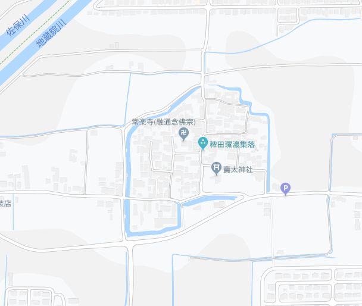

## 地名にほのかに残るもの

[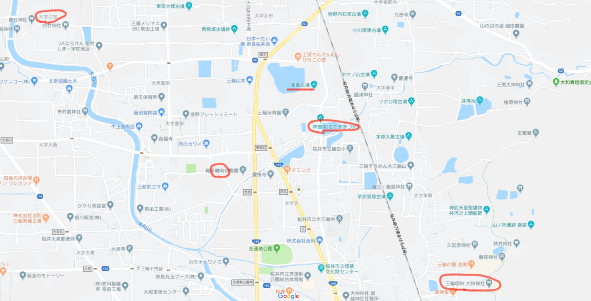](纒向近辺.png)

御綱祭の行われる「江包（えっつみ）」。  
いつからこの地名で呼ばれたかわからないが、「江で包む」＝環濠を連想させる名。ツツミは、包とともに堤で、堤が村を包むものだという、この言葉の語源的用法になっている。  
またツツは蛇の古語。ミヅチ（蛟）、野槌（ノヅチ）、ツチノコ、河童はミズシ、メドチ、ミンヅチ。稲妻はイカヅチ。ヤマタノオロチに娘を差し出すのは、アシナヅチ・テナヅチ。

地名といえば、「三輪」もまた、端的に輪をなす蛇として環濠を意味したかもしれない。  
「味酒」（うまさけ）という枕詞は、蛇に酒を供する八岐大蛇譚を思わせる。  
三輪の神は蛇体で、その正体は妻が通い夫を「苧環」（おだまき、糸巻き）でたどることで判明する。藁蛇祭のバリエーション。
「纒向」（まきむく）も巻きで、巻く蛇、男女結合の暗示がそこここに現れる。それは恵みと洪水をもたらす水の荒神でもある。  

## みとのまぐわい

もう少し神話的思考の翼を広げてみると。  
輪になった男女の交わりというと、天の御柱を中心にして、行き巡り会うイザナキ・イザナミの円運動。みとのまぐわい。  
イザナギ・イザナミの神話は、洪水のあと島に流れ着いた兄妹が世界の始まりとなる「洪水型兄妹始祖神話」のバリエーションとして捉えられている。大風呂敷を広げれば、それは伏羲・女媧からアダム・イブまで包み込む。

円運動といえば、盆踊りを思うこともできる。男女のムスビが生じる機会でもあり、また死者と生者が入り交じる真夏の夜の夢でもある。  
折口信夫はこうした「中心に柱をもつ円運動」の神話イメージを、ミトノマグワイから歌垣、猿楽田楽（御田植祭の花竿、住吉踊りの傘、田楽法師）と敷衍していき、盆踊りの円運動に行き着く歴史展開として捉えている。円環の反対の一致によって、男と女、死者と生者が出会う。

[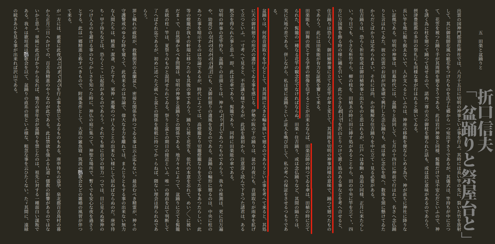](折口信夫「盆踊りと祭屋台と」.png)

交尾する藁蛇のお綱さまの祀られる江包・大西。このあたりにおそらく邪馬台国はあった。  
そして、ここに隣接する地域は観世親子の故郷でもある。観阿弥世阿弥が蛇祭に参加していた可能性は十分ある。  
卑弥呼から観世をつなぐ何かがある。舞は回ること、能は死者との語らい。対立物、一致し得ないものが、この地では結びあう。

|                    | **＋**       | **−**      | **結合の形**   | **生まれるもの** | **円環の中身** | **中心**     | **水の属性** |
| ------------------ | ------------ | ---------- | -------------- | ---------------- | -------------- | ------------ | ------------ |
| **ウロボロス**     | 頭、王、太陽 | 尾、后、月 | 輪             |                  |                |              |              |
| **ヨルムンガンド** |              |            | 海             |                  | ミッドガルド   | ユグドラシル | 津波         |
| **大和の藁蛇**     | 男綱         | 女綱       | 結び           | 雨               | 環濠集落       |              | 雨乞い       |
| **みとのまぐわい** | イザナキ     | イザナミ   | 行き廻りあいて | 国々、神々       | 中つ国？       | 天の御柱     | 海           |
| **うけひ**         | アマテラス   | スサノオ   |                | 神々             |                |              |              |
| **盆踊り**         | 生者         | 死者       | 輪になって踊ろ | 精霊を迎える     |                |              |              |
| **かごめかごめ**   | 夜明け、後ろ | 晩、正面   |                | 占い             |                | 籠の中の鳥   |              |
| **苗族の神話**     | 伏羲         | 女媧       | 蛇体           |                  |                |              |              |
| **妹背島**         | 兄           | 妹         | 結婚           | 人類             |                |              | 洪水         |
| **エデン**         | アダム       | イブ       | 蛇             | 人類             | エデンの園     | 知恵の木     | 洪水         |