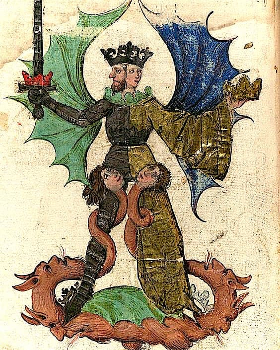
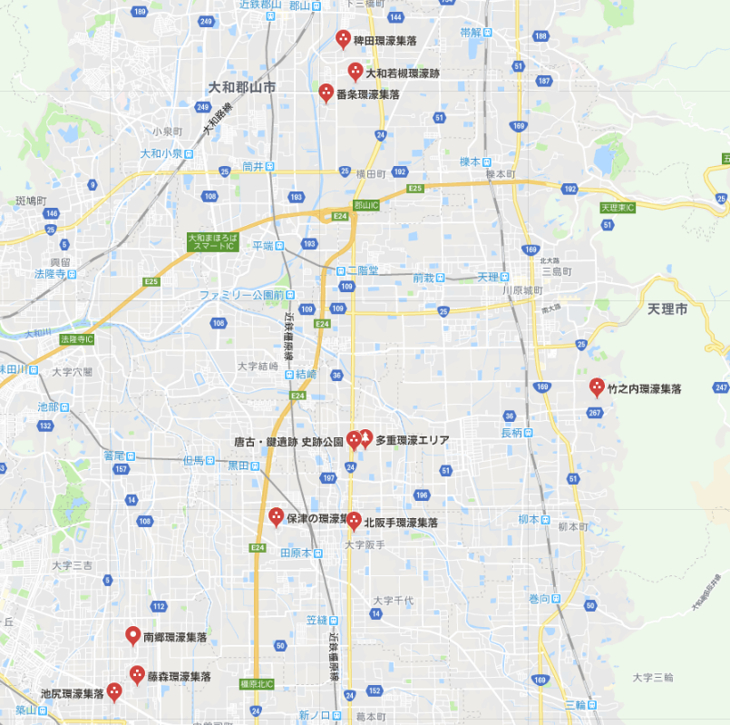



## 藁の蛇

自らの尾を噛んで閉じた円環をなすウロボロス。  
最大のウロボロスは、世界（ミッドガルド＝中つ国）を取り巻くヨルムンガンドだろう。北欧神話の巨大な蛇で、世界の終わり（ラグナロク）のとき、陸に侵攻し津波を起こす、と語られる。  
そのヨルムンガンドを奈良（大和）で見つけた、という妙な話をひとつ。

奈良というと、まずはJRや近鉄の奈良駅がある奈良市が思い浮かぶ。平城京のあった地域で、東大寺の大仏、春日神社の鹿など、修学旅行でもおなじみの界隈。  
その奈良から20キロほど南が、都を平城京に移す前、本来の大和と呼ばれた地域。三輪山の西、桜井市や田原本、さらに南や西の飛鳥・橿原、そして葛城山ふもとあたりまでの広がり。邪馬台国は近年、纒向近辺の可能性が高まっている。

この大和の地に、藁で作った蛇の祭が非常に多く見られる。野神とも蛇綱とも呼ばれる。いつから伝わるものかよくわからない。室町時代の文献を残すものもあるが、祭のもつ場違いなほどの野性味が、もっと古い起源を想像させる。地域ごとで祭に個性があり、このバリエーションが醸成される程度には古いとも言えるだろう。  
弥生時代、卑弥呼の頃にはすでにあったもの、という仮定も不可能ではない。稲作とともに古いのだと。それで説明できることが増えるなら、仮定を支持する傍証にはなる。

## 稲渕の男綱女綱―輪になる前の蛇

円環になる前にまず伸びている蛇を見てみよう。  
石舞台古墳から南に進むと山道になって山岳渓流が現れる。棚田で知られる稲渕。この渓流に男綱・女綱という、性器を模した蛇が掛けられている。渓流の南北、村境にあたるところに雄雌それぞれの綱が渡される。

皇極女帝が雨乞をしたことでも知られる渓流。うねうねと伸びた川が蛇体に見立てられている。水と蛇の連関はよく知られた象徴である。  
ふだんは南北の村境に離れ離れの雌雄だが、これが交わることで雨を呼ぶことができる仕組み。書紀では、道教マニアの皇極天皇が仏教に対抗し四方拝をしたことになっているが、蛇と雨の伝承がより古いベースにある。

## ウロボロスの原理としての愛

このあと、輪になった蛇を見ていくことになるが、その前にウロボロスとは何か、その原理を考えてみたい。

始まり（頭）と終わり（尾）が一致し円環をなすことで、対立物の結合、反対の一致を示す錬金術の象徴となる。実際、錬金術では、ウロボロスとともに、両性具有の王＝后や、太陽と月の結婚といった、対立物の結合を示す図像が描かれる。ふだんは両極にあるものが合体することで、特別な力を生じるというのが、ウロボロスの原理である。またの名を「愛」。

大和の藁の蛇も雌雄で表され、その結び目は反対の一致を象徴する。ムスビから生まれるのは、稲作のための水。雨であり、神格化すれば雷神がふさわしい。

水、蛇、愛。  
日本書紀や日本霊異記に登場する少子部スガル。雄略天皇と后のまぐわいを目撃したあと、三輪山の神である雷を、井戸で捉える。飛鳥の雷丘の由来譚でもあるこの話も、大和の藁蛇のバリエーション。  
対立物の結合としてのまぐわい（愛）、そして雷と井戸という水に関わるもの。三輪山の蛇。天と大地の結婚としての雷と降雨。

## 江包・大西の御綱−交わり続ける雌雄

大和の藁蛇（野神）祭でもっともでかく強烈な印象を残すのは、江包・大西の御綱祭。  
巨大な雌雄の蛇が、結合したままの姿で社の前に置かれている。稲渕の男綱女綱のように離れ離れでなく、祭のあとの日常の時も交わったままの姿。

なぜ結合したままのお姿なのか。  
その答えは環濠集落にある。稲渕で川の流れが蛇体に見立てられたのと同様に、ここでは村を取り巻く堀堤が蛇に見立てられる。そう、その姿はまるで、葦原中つ国を囲むヨルムンガンド。

大和は環濠集落が驚くほど多い。その伝統は弥生時代から中世・近世まで続く。田原本にある唐古・鍵遺跡という弥生遺跡。その復元図は蛇のように水路がのたうっている。石に刻まれたヨルムンガンドのよう。実際、ヨルムンガンド津波ならぬ大洪水に見舞われ村が沈み、また復元されたことが発掘でわかっている。

稗田阿礼の出身地とされる稗田も、現在まで綺麗に環濠集落が残る地域。村中にある賣太（めた）神社は、猿女田が略されたものといわれ、アメノウズメ＝猿女君＝稗田阿礼というつながりが見える。

御綱祭の行われる江包（えっつみ）。いつからこの地名で呼ばれたかわからないが、「江で包む」＝環濠を連想させる名。ツツミは、包とともに堤で、堤が村を包むものだという、語の語源的用法になっている。またツツは蛇の古語。ミヅチ（蛟）、野槌（ノヅチ）、ツチノコ、河童はミズシ、メドチ、ミンヅチ。稲妻はイカヅチ。ヤマタノオロチに娘を差し出すのは、アシナヅチ・テナヅチ。

地名といえば、三輪もまた、端的に輪をなす蛇として環濠を意味したかもしれない。味酒（うまさけ）という枕詞は、蛇に酒を供する八岐大蛇譚を思わせる。三輪の神は蛇体で、その正体は妻が通い夫を苧環（おだまき、糸巻き）でたどることで判明する。藁蛇祭のバリエーション。纒向（まきむく）も巻き。巻く蛇、男女結合の暗示。それは恵みと洪水をもたらす水の荒神でもある。

## みとのまぐわい

もう少し神話的思考の翼を広げてみると。
輪になった男女の交わりというと、天の御柱を行き巡り会うイザナキ・イザナミ。みとのまぐわい。洪水のあと島に流れ着いた兄妹が世界の始まりとなるというのは、洪水型兄妹始祖神話と呼ばれ、大風呂敷を広げれば伏羲・女媧からアダム・イブまで包み込む。

|                |      ＋      |     −      |    結合の形    | 生まれるもの |  円環の中身  |     中心     | 水の属性 |
| :------------: | :----------: | :--------: | :------------: | :----------: | :----------: | :----------: | :------: |
|   ウロボロス   | 頭、王、太陽 | 尾、后、月 |       輪       |              |              |              |          |
| ヨルムンガンド |              |            |       海       |              | ミッドガルド | ユグドラシル |   津波   |
|   大和の藁蛇   |     男綱     |    女綱    |      結び      |      雨      |   環濠集落   |      社      |  雨乞い  |
| みとのまぐわい |   イザナキ   |  イザナミ  | 行き廻りあいて |  国々、神々  |   中つ国？   |   天の御柱   |    海    |
|     うけひ     |  アマテラス  |  スサノオ  |                |     神々     |              |              |          |
|  少子部スガル  |   雄略天皇   |     后     |    まぐわい    | 雷、三輪の神 |              |     井戸     |   井戸   |
|     盆踊り     |     生者     |    死者    | 輪になって踊ろ | 精霊を迎える |              |              |          |
|  かごめかごめ  | 夜明け、後ろ |  晩、正面  |                |     占い     |              |  籠の中の鳥  |          |
|   苗族の神話   |     伏羲     |    女媧    |      蛇体      |              |              |              |          |
|     妹背島     |      兄      |     妹     |      結婚      |     人類     |              |              |   洪水   |
|     エデン     |    アダム    |    イブ    |       蛇       |     人類     |  エデンの園  |   知恵の木   |   洪水   |

ヨルムンガンドが囲むミッドガルドは世界樹ユグドラシルに支えられる。ユグドラシルはまた世界の中心であって、この樹自体が包み包まれるものとして円環をなす。世界の真ん中にそびえる柱。そのまわりで円環運動する男女。

折口信夫はこの神話イメージを、みとのまぐわいから歌垣、御田植祭の花竿、住吉踊りの傘、田楽法師と敷衍していき、盆踊りの円運動に行き着いている。円環の反対の一致によって、男と女、死者と生者が出会う。

交尾する藁蛇のお綱さまの祀られる江包・大西。このあたりにおそらく邪馬台国はあった。そして、ここに隣接する地域は観世親子の故郷でもある。観阿弥世阿弥が蛇祭に参加していた可能性は十分ある。卑弥呼から観世をつなぐ何かがある。舞は回ること、能は死者の語らい。対立物、一致し得ないものが、この地では結びあう。
